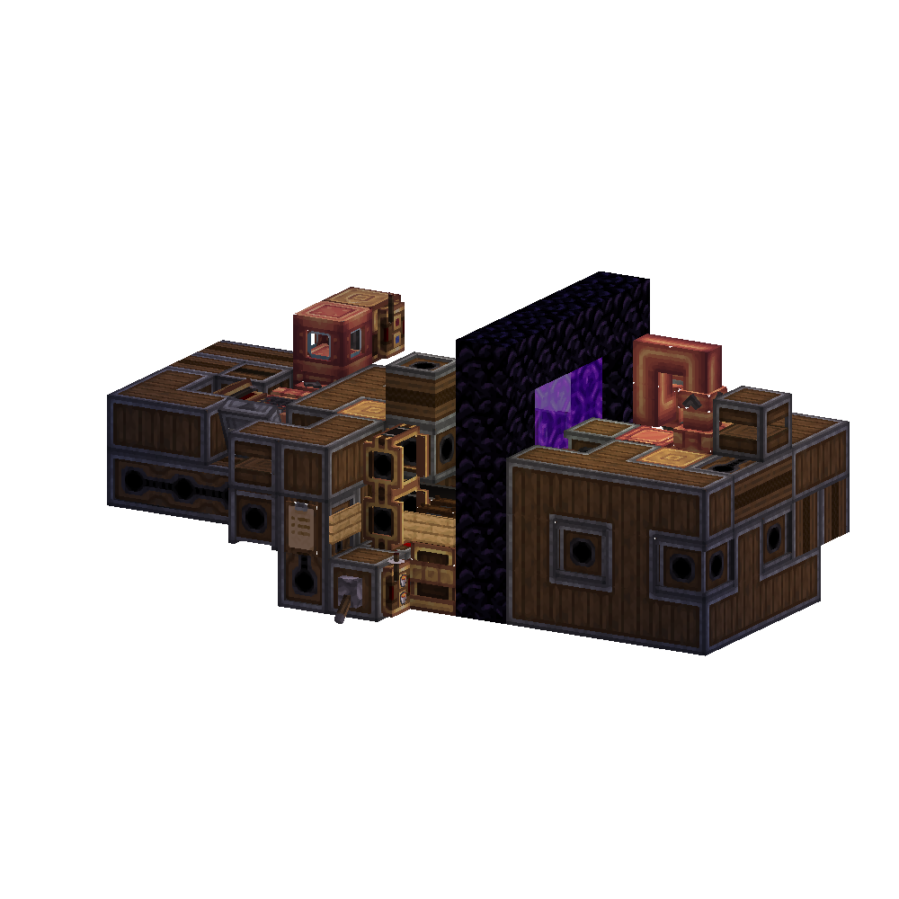
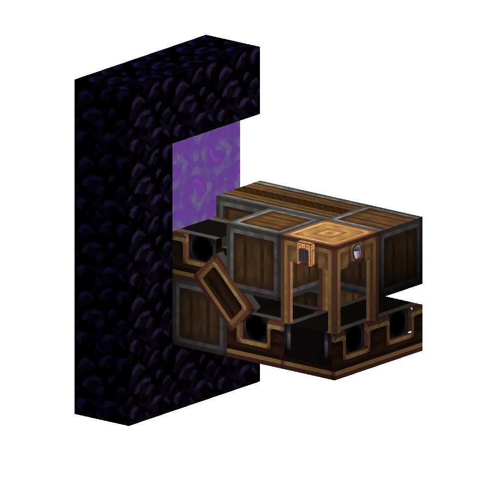
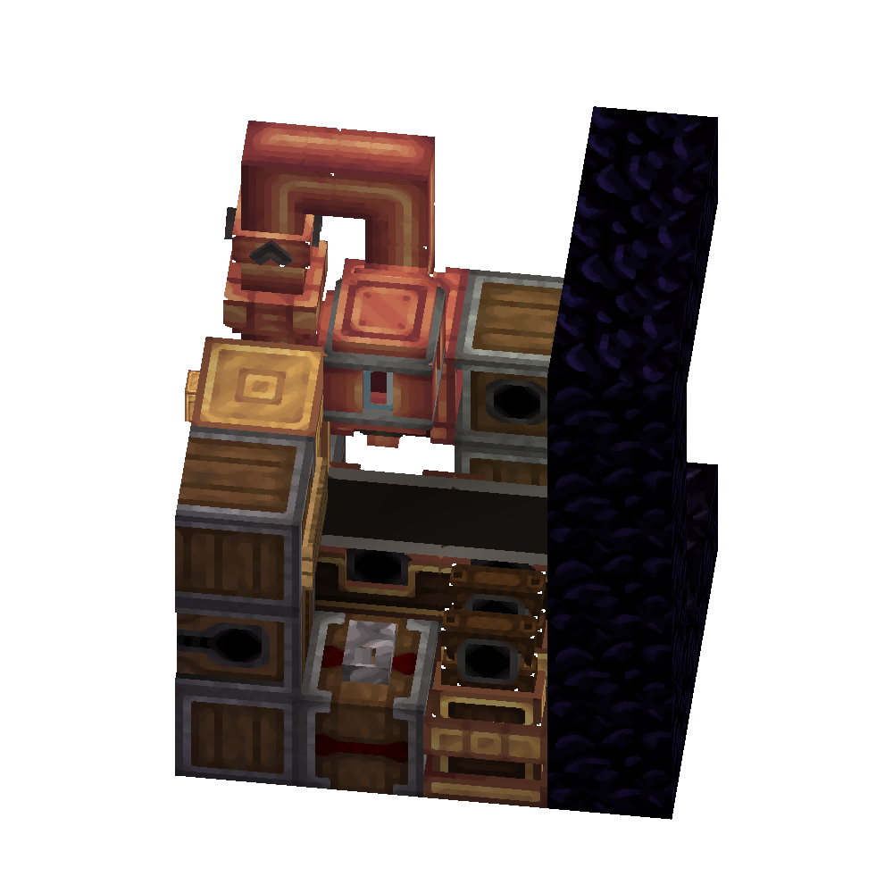

This is a technical manual for installation and usage of one of ZLogic's products. This manual is provided as an aid for installation and usage and does not provide any warranty of functionality if said instructions are followed perfectly. If any doubts arise, check our [Liability Clause/Terms of Service](../README.md#liability).

# Lava Collector

The Lava Collector is a machine developed by [ZLogic](https://github.com/EzequielDM/zlogic-contraptions) which in simple terms collects lava from the Nether and then transports it to the overworld. This machine depends on an infinite source of lava, which can be easily found in the Nether as any lava pond is big enough to be considered "infinite" (100+ Trillions Buckets of Lava).

This machine uses peak technology and engineering to reach great potential for very little cost. It's completely automated and features fully automatic stock control to make sure that you never run out of lava.

> The statement made about the user never running out of lava is purely metaphorical and exaggerated for scenic purposes. The machine does not provide infinite lava nor does it have any warranty. For more information, check our [Liability Clause/Terms of Service](../README.md#liability).

# What's in the package?

The package you'll receive contains a set of **two** schematics, one for Part A (The Overworld section) and one for Part B (The Nether section). Pieces, materials and tools are **NOT** included.

# Manual

## Setting up

The first step to setting up this machine is going to the Nether and finding a suitable location. There needs to be direct vertical line-of-sight between the desired Part B's [Hose Pulley](https://create.fandom.com/wiki/Hose_Pulley) location and a [big enough](https://create.fandom.com/wiki/Hose_Pulley#Usage) lava pool.

After locating and choosing a suitable location a 5x5 Nether portal must be set up to create a link between that location and the location in the Overworld where Part A will be setup. Make sure the portal in the Overworld is also 5x5. Go in and out of the portal some times to make sure that the dimensional warp link is correct and that there aren't any other portals in the area interfering with the connection as this may result in malfuctions and lost limbs.

In the Overworld, use the provided schematic for Part A (zlogic_lava_collector_a) and align the schematic preview's portal with the portal built in the overworld.

After having Part A built, identify the side where the empty buckets will be thrown into the portal. It can be identified by the belt going up in a slope. Below is an image of said part.

Keep in mind the position of the belt and enter the portal via the opposite side keeping your back to the output belt. Once in the Nether, the direction you're facing will be the direction where the buckets will be warped. That's where Part B's input should be.

_(Part B Input / This is the input side of the machine)_

Using the schematic, your knowledge of where the buckets will warp into and the location of Part B's input, place the schematic accordingly and build it.

## Preparation

Once both sides are built, the user can go forward into the preparation stage.

### Part A

On Part A's side there will be a small clipboard with a few checkboxes and a bit of information about the machine, here is what it says:

---

- [ ] Insert rotational speed
- [ ] Break and replace the tanks
- [ ] Expand the tank to your needs (Optional)
- [ ] Verify if Redstone Links' frequencies are fine (they may interfere with other equipment if the frequencies are used somewhere else)

ZLogic  
Logical Solutions

This machine does not have a minimum RPM requirement; therefore there isn't a specific SU requirement for it. For more information about the usage and setup of this machine, please check the manual at https://github.com/EzequielDM/zlogic-contraptions/wiki

---

As informed in the clipboard, these are some of the steps required to use the machine.

Going step-by-step:

#### Insert rotational speed

The machine needs power. Connect rotational power to it and adjust the [Rotation Speed Controller](https://create.fandom.com/wiki/Rotation_Speed_Controller) to the desired amount.  
**WARNING!** Do not change the rotation direction

#### Break and replace the tanks

This step is just a measure to prevent possible faults caused by [Schematicannon](https://create.fandom.com/wiki/Schematicannon) or [Godly Power](https://minecraft.fandom.com/wiki/Creative)'s printing issues. You can definitely lay back, relax and skip this step, at the end of the day, it's your machine and you are manly enough to set it up yourself without following measly instructions.

#### Expand the tank to your needs

This step is optional, and you may expand the tanks to accommodate your needs. The schematic supports a single tank of up to 3x32x3 (following [Create Fluid Tank®'s Datasheet](https://create.fandom.com/wiki/Fluid_Tank#Usage)). Taking the machine's portal as North, the [Threshold Switch](https://create.fandom.com/wiki/Threshold_Switch) should be in the Northwest side of the tank.

#### Verify redstone links' frequencies

[Redstone Links](https://create.fandom.com/wiki/Redstone_Additions#Redstone_Link) use radio frequencies to communicate with each other. The user should check if said frequencies are properly set and do not suffer any interference from other nearby Redstone Links.

#### Insert buckets

This step is not covered in the Clipboard, that's another reason to always read the Manuals. You should insert empty buckets into the system in Part A/B. You can insert them anywhere in the system.  
**WARNING!** We do not recommend inserting too many buckets, though the machine is yours and you are smart enough to figure out how many buckets is too many buckets. The customer is always right!

> The sentence "The customer is always right" does not represent any legal value and does not contradict nor pose any value against our [Liability Clause/Terms of Service](../README.md#liability).

### Part B

There isn't much setup needed on Part B's side. It only requires rotational power to function; everything else works straight out of the box. This goes to show the level of engineering that ZLogic's products boast, you can always count on ZLogic to amaze you with marvelous contraptions.

## Power usage

The Lava Collector does not have a specific RPM requirement, therefore there is not a single number to define how much SU is needed for it to operate.

Although that is in fact true, we provide a short table with common values to aid the user in setting up the machine.

### Part A

| RPM     | SU Needed          |
| ------- | ------------------ |
| 1 RPM   | 6 Stress Units     |
| 32 RPM  | 192 Stress Units   |
| 96 RPM  | 576 Stress Units   |
| 128 RPM | 768 Stress Units   |
| 160 RPM | 960 Stress Units   |
| 192 RPM | 1,152 Stress Units |
| 224 RPM | 1,344 Stress Units |
| 256 RPM | 1,536 Stress Units |

### Part B

| RPM     | SU Needed          |
| ------- | ------------------ |
| 1 RPM   | 8 Stress Units     |
| 32 RPM  | 256 Stress Units   |
| 96 RPM  | 768 Stress Units   |
| 128 RPM | 1,024 Stress Units |
| 160 RPM | 1,280 Stress Units |
| 192 RPM | 1,536 Stress Units |
| 224 RPM | 1,792 Stress Units |
| 256 RPM | 2,048 Stress Units |

# Production rates

The production rates for this machine are variable and depend on many factors, including:

- The rotational speed provided to the machine
- The amount of buckets running on the system
- The weather
- The atmospheric pressure
- The position of the Sun
- The current phase of the moon and its gravitational pull
- The current state of entropic bonding of the particles that constitute the machine
- The atomic velocity of the 4,657,334th atom from the Rotation Speed Controller's shaft considering a Northwest starting point counting downwards on a precise 90° angle.
- The quantum entanglement resonance coherence flux: This factor refers to the intricate interplay between quantum entanglement, resonance phenomena, and coherence flux within the machine's internal components. The quantum entanglement resonance coherence flux is influenced by various complex physics phenomena that may affect the Lava Collector's performance, such as:

  - Superposition instability: The sensitivity of the machine's quantum state to external perturbations caused by factors like electromagnetic fields or temperature fluctuations. The degree of superposition instability can lead to unpredictable changes in the machine's quantum properties, affecting its overall performance.

  - Quantum decoherence entropy: The rate at which quantum coherence, necessary for maintaining delicate quantum states, is lost due to interactions with the environment. High quantum decoherence entropy can lead to reduced coherence times and increased errors in the machine's quantum computations or operations.

  - Quantum tunneling interference: The phenomenon where quantum particles can bypass traditional energy barriers by "tunneling" through them. The presence of quantum tunneling interference can cause unexpected energy flow within the machine's components, potentially altering its performance in unpredictable ways.

  - Spin-orbit coupling entanglement: The interaction between an object's spin (intrinsic angular momentum) and its orbital motion due to electromagnetic fields. The spin-orbit coupling entanglement can introduce additional complexities in the behavior of the machine's quantum states, impacting its stability and overall functionality.

  - Casimir effect modulation: The fluctuation of electromagnetic fields arising from vacuum fluctuations between closely spaced conducting surfaces. The Casimir effect modulation can induce subtle changes in the machine's electromagnetic environment, leading to altered interactions and energy distributions among its components.

  Considering the intricate nature of these complex physics phenomena, the quantum entanglement resonance coherence flux serves as an extremely challenging and multifaceted factor that could significantly influence the performance of the ZLogic®'s Lava Collector if the user does not take the appropriate measures to prevent it.
